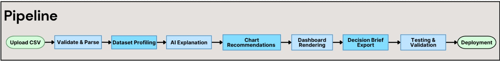

# DataPilot — Dataset Analysis & Decision Support Studio

Team 07, "AI in Applications" training project. A data-insight studio: user uploads
a CSV → deterministic code profiles it (schema, missing values, duplicates,
outliers) → AI explains the findings and answers questions → chart rules
recommend visualizations → user exports a decision brief.

This file tracks what's actually been built vs. what's still planned, so
anyone (human or AI) picking this project back up knows exactly where it
stands. Update it as work lands — don't let it go stale.

## Links

- **Live app:** https://data-pilot-project.vercel.app/
- **Sample dataset (Kaggle):** [2026 World Cup Player Statistics](https://www.kaggle.com/datasets/troubador/2026-world-cup-player-statistics) — used for manual end-to-end testing.

## Problem & Solution

**The problem:** Most people with a CSV of data — sales numbers, survey
results, sports stats — aren't data analysts. They can open the file, but
they don't know if it's clean, what's actually notable in it, which chart
best represents a given question, or how to turn any of that into something
they could hand to someone else (a report, a set of decisions). Manually
profiling a dataset (missing values, duplicates, outliers, correlations)
and then writing up findings takes real expertise and time most users
don't have.

**How DataPilot fixes it:**
1. **Deterministic profiling on upload** — the moment a CSV/TSV lands,
   `buildDatasetProfile()` computes schema, missing values, duplicate
   rows, IQR-based outliers, correlations, and a 0–100 data quality
   score — instantly, with no AI involved, so the numbers are always
   trustworthy and reproducible.
2. **AI explains, never calculates** — Gemini is layered on top purely to
   translate those computed facts into plain-language analyst notes and
   answers to open questions, under a hard "never invent a number"
   contract (`GROUNDING_DATA` + system instruction in `src/lib/gemini.ts`).
3. **Guided cleanup, not auto-editing** — data-quality issues are surfaced
   as proposals the user approves or rejects; nothing is silently changed.
4. **Chart recommendations** — rule-based suggestions point the user to
   the visualization that fits their data, instead of guessing.
5. **One-click export** — the whole analysis (score, findings, charts,
   AI recommendations) becomes a PDF or DOCX decision brief, so the
   output is something shareable, not just an in-app view.

In short: the site turns "I have a CSV and don't know what to do with it"
into a guided, explainable path from raw data → verified findings →
a document someone can act on — without requiring the user to know any
statistics themselves.

## Team meeting notes

- Discussed the problem statement and clarified the project's objectives
  and expected outcomes.
- Reviewed the project structure, including the overall pipeline and
  system architecture.
- Discussed the API response schema to ensure consistency and ease of
  integration between components.
- Agreed to use Supabase for authentication and Vercel for application
  deployment.
- Planned future enhancements, including:
  1. Implementing data quality checks to validate uploaded or processed data.
  2. Adding AI-powered smart solutions to automatically detect and fix
     data quality issues.

## Architecture style

**Layered / flat** — Route Handlers under `src/app/api/datapilot/` call
`src/lib/csv-profiler.ts` and `src/lib/gemini.ts` directly by name. There is
no ports/adapters (hexagonal) layer: no interfaces abstracting the AI
provider or storage, and no composition root wiring implementations to
abstractions. That's an intentional trade-off for this project's scope —
single AI provider, no swappable storage — not an oversight. See
`docs/architecture.md` for the full request-flow breakdown.

### Diagrams

**System architecture:**


**Data pipeline:**


## Team

| Role | Name |
|---|---|
| Integration Lead / Solution Architect — **Team Leader** | Ahmed Abdel Hamid |
| AI & Backend Engineer | Youssef Elfeshawy |
| Product UI & Workflow Engineer | Omar Metwally |
| Knowledge, Tools & Quality Engineer | Ahmad Essam |

## Status: frontend, auth, deterministic profiling, data-quality score, cleaning-proposal review, the Gemini explanation/Q&A layer, decision-support recommendation generation, full report export, training-required docs, and Vercel deployment are all done

### Done
- **Frontend UI** (Next.js App Router, TypeScript, Tailwind, shadcn/ui,
  recharts) — pages for landing, upload, analyzing, dashboard, data-quality,
  charts, insights, ask-ai, reports, settings.
- **Supabase auth** — `/login` and `/signup` pages, Server Actions
  (`src/lib/auth-actions.ts`) for sign in/up/out, `src/proxy.ts` (Next 16
  renamed `middleware.ts` to `proxy.ts` — see AGENTS.md) refreshes the
  session and redirects signed-out users away from every app route, and an
  `/auth/callback` route handler for email confirmation. `navbar.tsx` and
  `settings/page.tsx` now show the real signed-in user instead of the old
  hardcoded "Omar Lotfy" fake profile. Requires a Supabase project — copy
  `.env.local.example` to `.env.local` and fill in the project URL/anon key.
  Note: `signIn`/`signUp`/`signOut` are Server Actions, not an API route —
  that's still a separate not-started item below.
- **Deterministic server-side profiling** — `POST /api/datapilot/upload`
  (`src/app/api/datapilot/upload/route.ts`) now does the real work: requires
  a signed-in user, validates the file is `.csv`/`.tsv`, non-empty, under
  `MAX_UPLOAD_BYTES` (15 MB) and `MAX_ROWS` (100,000 rows) — both defined in
  `src/lib/csv-profiler.ts` — parses it server-side with
  `parseCsvText()`, and runs the existing `buildDatasetProfile()` (rows/
  columns/types, missing values, duplicate rows, IQR-based outliers, Pearson
  correlation, chart recommendations) before returning the JSON profile.
  `upload-area.tsx` now POSTs the file here instead of parsing in the
  browser. This is the required `profile_dataset()` / `recommend_chart()`
  deterministic tool — `recommend_chart()`'s logic already lives inside
  `buildDatasetProfile()`'s chart-recommendation section, not yet split into
  its own function.
- **Mock/fake content removed** (see commit history / prior session):
  - Fake "sample dataset" fallback deleted from `lib/dataset-store.tsx` —
    pages now show a real "no dataset uploaded" empty state instead of
    silently displaying fabricated numbers.
  - Hardcoded canned "AI" chat replies deleted from `app/ask-ai/page.tsx`.
  - Fake "Recent uploads" list deleted from `app/upload/page.tsx`.
  - "Live demo" links removed from the landing page nav/hero (they pointed
    at what was fake sample data).
  - `lib/mock-data.ts` deleted entirely; the one legitimate piece it held
    (`reportSections`, real UI config) moved to `lib/report-config.ts`.
  - `tsc --noEmit` and `eslint` both pass clean after the above.
- **Report export UI** (`app/reports/page.tsx`) — selective section
  toggles + PDF/DOCX export already implemented client-side
  (`lib/report-generator.ts`).
- **Data-quality score** — `DataQualityScore` / `QualityScoreFactor` types
  added to `types.ts`; `computeDataQualityScore()` in `csv-profiler.ts`
  produces a deterministic 0–100 score (100 minus capped point deductions
  for missing %, duplicate %, outlier %, inconsistent-label %, and dtype
  mismatches). Every deduction carries the exact rule and measurement used,
  so the formula is fully visible to the user — never a black box, and
  never AI-generated. Surfaced via a new `QualityScoreCard`
  (`components/shared/quality-score-card.tsx`) on `/data-quality`, a KPI
  tile on `/dashboard`, and a new `answerFromProfile()` pattern for
  "what's my quality score" style questions on `/ask-ai`. `tsc --noEmit`
  and `eslint` both pass clean on the changed files.
- **Cleaning-suggestion proposals + approve/reject flow (no auto-apply)** —
  `DataIssue` now carries `status: "pending" | "approved" | "rejected"`
  (`CleaningProposalStatus` in `types.ts`), initialized to `"pending"` for
  every issue `csv-profiler.ts` flags. `dataset-store.tsx` exposes
  `updateIssueStatus()` via a new `useCleaningProposals()` hook, which
  updates just that one issue's status in the stored profile — it never
  touches the underlying dataset, per the "no auto-apply" requirement.
  `IssueCard` has Approve/Reject/Reset buttons and a status pill;
  `/data-quality` shows a review-progress line (approved/rejected/pending
  counts) above the issue list. PDF/DOCX export (`report-generator.ts`)
  now prints each fix's decision. Ask AI can answer "how many fixes have
  I approved" style questions via `answerFromProfile()`.
- **Gemini explanation layer + grounded NL Q&A** —
  `src/lib/gemini.ts` (server-only, imports the new `server-only` package —
  added to `package.json` dependencies — so it can never be pulled into
  client code) calls the Gemini `generateContent` REST API directly (no
  SDK dependency). Every call is prefixed with a system instruction that
  hard-requires the model to copy numbers only from a `GROUNDING_DATA`
  JSON block built from the deterministic profile (`buildGroundingData()`
  — strips chart pixel/point arrays, keeps only scalar facts) and to say
  "not computed yet" rather than invent a statistic. Two new routes:
  `POST /api/datapilot/ask` (grounded NL Q&A, returns plain text) and
  `POST /api/datapilot/explain` (returns AI-authored `AiInsightSection[]`,
  requesting `responseMimeType: "application/json"` and validating the
  shape before use). Both require a signed-in user and both return a clean
  503 if `GEMINI_API_KEY` isn't set, so the app degrades gracefully
  instead of erroring.
  - `/ask-ai`: `answerFromProfile()` still runs first (instant, exact); only
    unrecognized questions fall back to `askGemini()` via the new
    `src/lib/ai-client.ts`. Replies are tagged `source: "ai"` vs
    `"deterministic"` on `ChatMessage`, shown as a small "AI-generated"
    pill in `AiMessageBubble` (which also no longer hardcodes "OL" for the
    user avatar — it now uses `initialsFor(user)` from `auth-store.tsx`,
    a leftover from the old fake-profile cleanup).
  - `/insights`: new "AI Analyst Notes" section auto-generates on load via
    `explainWithGemini()`, with loading/error/regenerate states. Persisted
    onto `profile.aiAnalystNotes` (via `useAiContent()` in
    `dataset-store.tsx`) once generated, so report export can include them
    without re-generating and revisiting `/insights` doesn't re-trigger a
    Gemini call — kept separate from the deterministic `insights` field so
    nothing existing (dashboard counts) changes shape.
  - Model is `gemini-2.5-flash` by default, overridable with
    `GEMINI_MODEL` — Gemini model names get deprecated frequently, so this
    is documented in `.env.local.example` next to where the key goes.
- **Decision-support recommendation generation** — `DecisionRecommendation`
  type added to `types.ts` (`title`, `body`, `priority: "high" | "medium" |
  "low"`, `basedOn: string[]` citing the exact issue/insight titles it was
  grounded in). `generateDecisionSupportWithGemini()` in `gemini.ts` reuses
  `buildGroundingData()`, now extended with explicit
  `cleaningDecisionCounts` (approved/rejected/pending) and the deterministic
  `insights` array, so recommendations read the user's actual fix decisions
  and existing findings instead of just restating them — this is the "a
  step up from explanatory notes" requirement from the target pipeline.
  New route `POST /api/datapilot/recommend` (auth-gated, clean 503 if
  `GEMINI_API_KEY` missing) and `src/lib/ai-client.ts#generateDecisionSupport()`
  follow the exact same shape as the explain route. Rendered on `/insights`
  as a new "Decision-Support Recommendations" section below AI Analyst
  Notes (`RecommendationCard` + new `PriorityBadge` in `status-badge.tsx`),
  auto-generates once per uploaded dataset, with a manual "Regenerate"
  button to refresh after approving/rejecting cleaning fixes (those
  decisions don't change the dataset name the auto-generate effect keys
  off, so they don't trigger it automatically). Persisted onto
  `profile.decisionRecommendations` the same way as the AI Analyst Notes.
- **Report export extended to cover AI Analyst Notes and decision-support**
  — `DatasetProfile` gained two optional fields, `aiAnalystNotes` and
  `decisionRecommendations`, written by a new `useAiContent()` hook
  (`setAiAnalystNotes()` / `setDecisionRecommendations()`) in
  `dataset-store.tsx`, sharing the same localStorage-persisting
  `patchProfile()` helper `updateIssueStatus()` already used. `/insights`
  now initializes each section's state from these fields (skipping
  auto-generation entirely if already persisted) instead of always
  re-calling Gemini on every visit. `report-config.ts` has two new
  sections — sec-8 "AI Analyst Notes", sec-9 "Decision-Support
  Recommendations" (both default-included) — and `buildReportOutline()`
  in `report-generator.ts` renders them into both PDF and DOCX, falling
  back to a "visit Insights to generate them first" message if the user
  exports before either has been generated.
- **Training-required docs** — `docs/architecture.md` (system overview,
  request flow, the grounding contract, deterministic-vs-AI insights,
  client-side state/persistence, data storage, auth, report export,
  tech stack), `docs/api-contracts.md` (every `/api/datapilot/*` route:
  auth, request/response shapes, error codes — plus a note that
  sign in/up/out are Server Actions, not routes), and
  `docs/release-checklist.md` (env vars, Supabase setup, pre-deploy
  checks, Vercel deploy steps + smoke tests, known limits). Note:
  `npm run build` needs outbound access to `fonts.googleapis.com` at
  build time (`next/font/google` in `layout.tsx`) — fine on Vercel, but
  documented in the checklist since it fails in network-restricted
  build environments.

- **Vercel deployment** — live, with environment variables set
  (`GEMINI_API_KEY` alongside the Supabase vars) per
  `docs/release-checklist.md`.

All of the above pass `tsc --noEmit` and `eslint` clean across the entire
`src` tree as of this revision.

### Not started yet
- Nothing outstanding from the original build order — see "Suggested
  build order" below, all steps are now checked off.

## Target pipeline

```
Landing (done)
  → Supabase Auth: signup/login (done — src/app/login, src/app/signup,
    src/proxy.ts, src/lib/auth-actions.ts)
  → Upload → POST /api/datapilot/upload (done — src/app/api/datapilot/upload/route.ts)
       → profile_dataset() [done — src/lib/csv-profiler.ts, runs server-side]
       → data-quality score [done — computeDataQualityScore() in src/lib/csv-profiler.ts, formula shown to the user on /data-quality]
       → cleaning suggestions as proposals only, user approves before anything changes [done — DataIssue.status + updateIssueStatus() in src/lib/dataset-store.tsx, no auto-apply]
       → recommend_chart() [done, server-side — still inlined in buildDatasetProfile(), not split out]
       → Gemini: explain findings [done — POST /api/datapilot/explain, src/lib/gemini.ts,
         rendered as "AI Analyst Notes" on /insights] / answer NL questions [done —
         POST /api/datapilot/ask, fallback from answerFromProfile() on /ask-ai] /
         write decision-support text [done — POST /api/datapilot/recommend,
         generateDecisionSupportWithGemini() in src/lib/gemini.ts, rendered as
         "Decision-Support Recommendations" on /insights, reads approved/rejected
         cleaning decisions]
         — Gemini explains only, never invents numbers (hard requirement, enforced via
           the GROUNDING_DATA system instruction in src/lib/gemini.ts)
  → Ask AI → NL question → deterministic query over already-computed profile first
    (answerFromProfile(), instant), Gemini fallback for open-ended questions (done)
  → Export → user picks sections (score / suggestions / charts / recommendations) → PDF/DOCX
    [done — report-config.ts has sec-8 AI Analyst Notes + sec-9 Decision-Support
    Recommendations, buildReportOutline() in report-generator.ts renders both]
```

**Hard constraint carried through every step:** all numeric/statistical
values must come from deterministic code. The AI may explain or recommend,
but must never calculate or fabricate a number. The Gemini API key must
never reach the client — it lives only in server route handlers.

## Suggested build order (from here)

1. ~~Supabase auth (`/login`, `/signup`, session proxy protecting the app
   routes).~~ Done.
2. ~~Move CSV parsing + `profile_dataset()` into a server route
   (`/api/datapilot/upload`), with size/row limits and safe parsing.~~ Done.
3. ~~Add data-quality score (deterministic, formula shown to user) to
   `types.ts` and the profiler.~~ Done.
4. ~~Cleaning-suggestion proposals + user approve/reject flow (no
   auto-apply).~~ Done.
5. ~~Gemini explanation layer + NL Q&A on top of computed results.~~ Done.
6. ~~Decision-support recommendation generation.~~ Done.
7. ~~Extend export to cover the new sections.~~ Done.
8. ~~`docs/architecture.md`, `docs/api-contracts.md`,
   `docs/release-checklist.md`.~~ Done.
9. ~~Vercel deploy + env vars (steps documented in
   `docs/release-checklist.md`).~~ Done.

## Out of scope (per training handbook)

Executing arbitrary uploaded code, processing very large/private datasets,
letting AI invent statistics.
